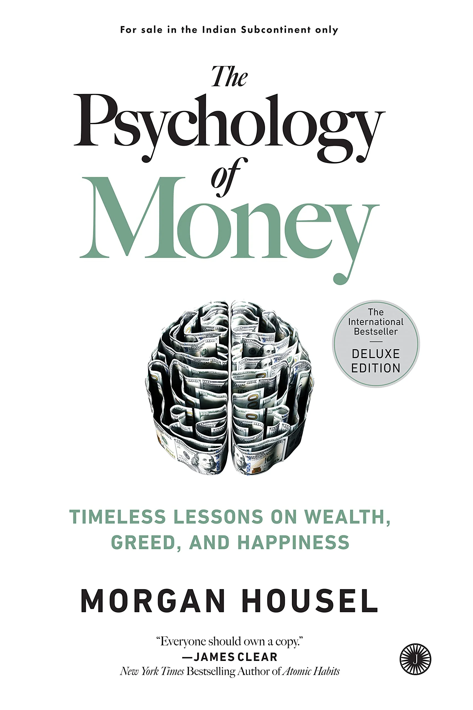

# The Psychology Of Money 🧠

* A genius who loses control of their emotions can be a financial disaster. the opposite is also true. ordinary folks with no financial education can be wealthy if they have a handful of **behavioural skills** that have nothing to do with financial measures of intelligence.
* **Financial success** is not a hard science, it's a **soft skill**, where how you behave is more important than what you know.
* **Personal Finance** [ 6 month emergency fund and save 10% of your salary ]
* **Health** and **Money** impact everyone and goes hand in hand.
* The problem is that we think about and taught about money in ways that are too much like physics ( with rules and laws ) and not enough like *psychology* ( with **emotions** and **nuance** )
* Physic isn't controversial ( it's guided by laws ) and not enough like psychology ( it's guided by **people's behaviour** )
* Finance ( **psychology** and **history** ) : " *History never repeat itself; man always do* ".
